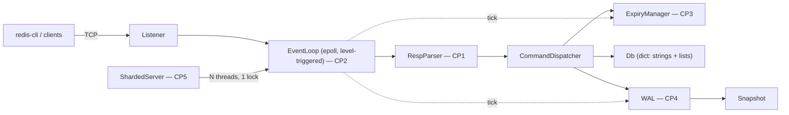

# hermitdb

A RESP2-compatible in-memory key-value store in C++17. Speaks to the official
`redis-cli` and `redis-benchmark`. epoll reactor, TTL expiry, write-ahead-log
persistence with crash recovery, configurable threading — no Boost, no
libevent, no third-party protocol or hash-table libraries.

> ## ⚠️ Read this before using this branch for anything
>
> **This copy is the AI-completed variant. The checkpoints were NOT hand-written.**
>
> The parent project (`~/Documents/hermitdb`) uses a learning-checkpoint split:
> Claude Code builds scaffolding, and **Sahil personally implements CP1–CP5**,
> because "parse a framed protocol off a stream" and "what does `fsync` actually
> guarantee" are the questions interviews are made of. That split is the whole
> point of the project.
>
> In **this** copy, CP1–CP5 and DECISIONS 1–6 were written by Claude Code, at
> Sahil's explicit request, in a clone so the original stays untouched. The
> commits are prefixed `ai-cp<N>:` rather than the SPEC's `cp<N>:` so the git
> history cannot be mistaken about who wrote what.
>
> **Consequences, stated plainly:** nothing here belongs on a résumé or in an
> interview as personal implementation work, and this branch should not be
> pushed over the public repo. Its legitimate uses are as a reference to check
> a hand-written implementation against, and as a measurement of what the
> finished system performs like. Its `origin` remote has been removed to make
> the accident harder.

| Checkpoint | Component | Status | Author |
|---|---|---|---|
| CP1 | Incremental RESP2 parser | ✅ complete | Claude Code |
| CP2 | epoll event loop (level-triggered) | ✅ complete | Claude Code |
| CP3 | TTL expiry (lazy + sampled active) | ✅ complete | Claude Code |
| CP4 | Write-ahead log + crash recovery | ✅ complete | Claude Code |
| CP5 | Threading model (N reactors, locked keyspace) | ✅ complete | Claude Code |
| CP6 | LRU eviction (stretch) | ⏳ not implemented | — |
| M7 | Adversarial review (`checkpoints/VIVA.md`) | ⏳ not run | — |

M7 is a viva over hand-written code and is meaningless against generated code,
so it was skipped rather than faked.

**Definition of done (SPEC §1) — verified:**

```
docker run -p 6380:6380 hermitdb        # boots
redis-cli -p 6380 SET k v EX 600        # official client: OK
redis-benchmark -p 6380 -t set,get      # produces the numbers below
kill -9 && restart                      # state recovered from WAL, TTL intact
ctest                                   # 15/15 green
```

The `kill -9` round-trip is worth spelling out: after SIGKILL and restart,
`TTL greeting` returned **590**, not 600. The TTL did not reset — see
[DECISION-3](DECISIONS.md#decision-3--clock-source-for-ttl--replay-determinism).

## Quickstart

```bash
docker build -t hermitdb .
docker run --rm -p 6380:6380 hermitdb
redis-cli -p 6380 SET greeting hello EX 60
redis-cli -p 6380 GET greeting
```

With persistence and threads (`--fsync` is mandatory whenever `--wal` is on —
see [DECISION-2](DECISIONS.md#decision-2--fsync-policy-default-always--everysec--no)):

```bash
docker run --rm -p 6380:6380 -v hermitdata:/data hermitdb \
  --port=6380 --data-dir=/data --wal --fsync=everysec --threads=4
```

Development happens inside the Linux dev container (epoll doesn't exist on
macOS):

```bash
make image      # once
make configure  # once
make build
make test       # scaffold + m3 tests — always green
make test-all   # everything, including the checkpoint suites
make run        # server on localhost:6380
make cli        # redis-cli against it (separate terminal)
```

Re-run the whole integration suite against another server configuration —
this is how the threading model is accepted:

```bash
HERMIT_EXTRA_ARGS=--threads=8 ctest --test-dir build --output-on-failure
```

## Command set

| Family | Commands |
|---|---|
| Connection | `PING` `ECHO` `COMMAND` `SHUTDOWN` |
| Strings | `SET` (`EX` `PX` `NX` `XX`) `GET` `INCR` `DECR` `INCRBY` |
| Keyspace | `DEL` `EXISTS` `TYPE` `KEYS <glob>` `DBSIZE` `FLUSHALL` |
| TTL | `EXPIRE` `PEXPIRE` `PEXPIREAT` `TTL` `PTTL` `PERSIST` |
| Lists | `LPUSH` `RPUSH` `LPOP` `RPOP` `LRANGE` `LLEN` |
| Server | `CONFIG GET` (stub) |

`PEXPIREAT` exists mostly for the WAL: relative expirations are rewritten to
absolute deadlines before they are logged, so replay cannot extend TTLs by the
length of the downtime.

Error semantics mirror Redis byte-for-byte (`-ERR wrong number of arguments
for 'get' command`, `-WRONGTYPE ...`, `:N` / `$-1` / `*0` replies) — the m3
unit suite pins the exact wire strings.

## Architecture



One reactor per thread: `epoll_wait` → drain socket → incremental RESP parse →
dispatch table → reply bytes queued back on the connection. Everything except
the keyspace mutation itself runs outside the lock. TTL expiry is two-pronged
like real Redis (lazy check on every key access + a budgeted random-sampling
pass on the loop tick). Persistence is snapshot + WAL tail: every mutating
command is appended in RESP encoding (the WAL format *is* the wire format), and
recovery loads the snapshot then replays the tail.

## Benchmarks

<!--BENCH_TABLE-->

## Design decisions

Every load-bearing choice is argued in [DECISIONS.md](DECISIONS.md) — LT vs ET
epoll, fsync policy and the append/reply ordering, TTL clock source and replay
determinism, threading architecture, dict implementation, DoS-surface caps.
All six are resolved, each with the measurement or the failure mode that
decided it, and each stating what it does **not** buy. Interface-change
requests from scaffolding work are argued in
[INTERFACE_PROPOSALS.md](INTERFACE_PROPOSALS.md), not applied silently.

## What I'd build next

**Striped keyspace locks**, first — the thread-scaling rows above are the
argument for it, and `util/hash.h` already has the routing hash. **CRC32 per
WAL record**: today a torn tail is detected (it does not parse) but bit rot
mid-file is not, and would replay as a plausible command. **`maxmemory` +
eviction** (CP6) — the keyspace currently grows until the OOM killer arrives,
and the README says so rather than implying a bound that does not exist. Then
replication (a WAL is already a replication log looking for a follower), RESP3,
and io_uring — the `epoll_wait`/`recv`/`send` syscall triple per request is
exactly what submission rings exist to amortize.

## How this was built

The git history is the honest record, and in this copy it says something
different from the parent project — see the warning at the top.

- `scaffold:` — project plumbing generated by Claude Code: build system,
  keyspace, command dispatch, snapshot serialization, tests, bench harness,
  docs.
- `ai-cp<N>:` — the checkpoint implementations in **this** copy: the RESP
  parser, epoll reactor, TTL expiry, WAL, and threading model. Written by
  Claude Code, not by hand.
- `cp<N>:` — reserved by SPEC §0.6 for hand-written checkpoint commits. **There
  are none in this copy.** That is the distinction the prefix exists to make.

Acceptance tests for every checkpoint were written against the stubs and fail
(or skip, loudly) until a real implementation lands — a stub passing silently
is treated as a bug in the tests. Study sheets are in [checkpoints/](checkpoints/).
