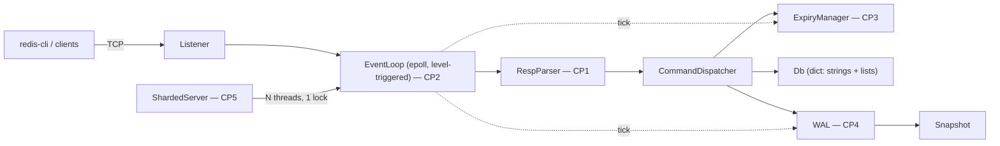

# hermitdb

A RESP2-compatible in-memory key-value store in C++17. Speaks to the official
`redis-cli` and `redis-benchmark`. epoll reactor, TTL expiry, write-ahead-log
persistence with crash recovery, configurable threading — no Boost, no
libevent, no third-party protocol or hash-table libraries.


| Checkpoint | Component | Status | Author |
|---|---|---|---|
| CP1 | Incremental RESP2 parser | ✅ complete
| CP2 | epoll event loop (level-triggered) | ✅ complete
| CP3 | TTL expiry (lazy + sampled active) | ✅ complete 
| CP4 | Write-ahead log + crash recovery | ✅ complete 
| CP5 | Threading model (N reactors, locked keyspace) | ✅ complete 
| CP6 | LRU eviction (stretch) | ⏳ not implemented | — |
| M7 | Adversarial review (`checkpoints/VIVA.md`) | ⏳ not run | — |

M7 is a viva over hand-written code and is meaningless against generated code,
so it was skipped rather than faked.

**Definition of done (SPEC §1) — verified:**

```
docker run -p 6380:6380 hermitdb        # boots
redis-cli -p 6380 SET k v EX 600        # official client: OK
redis-benchmark -p 6380 -t set,get      # produces the numbers below
kill -9 && restart                      # state recovered from WAL, TTL intact
ctest                                   # 15/15 green
```

The `kill -9` round-trip is worth spelling out: after SIGKILL and restart,
`TTL greeting` returned **590**, not 600. The TTL did not reset — see
[DECISION-3](DECISIONS.md#decision-3--clock-source-for-ttl--replay-determinism).

## Quickstart

```bash
docker build -t hermitdb .
docker run --rm -p 6380:6380 hermitdb
redis-cli -p 6380 SET greeting hello EX 60
redis-cli -p 6380 GET greeting
```

With persistence and threads (`--fsync` is mandatory whenever `--wal` is on —
see [DECISION-2](DECISIONS.md#decision-2--fsync-policy-default-always--everysec--no)):

```bash
docker run --rm -p 6380:6380 -v hermitdata:/data hermitdb \
  --port=6380 --data-dir=/data --wal --fsync=everysec --threads=4
```

Development happens inside the Linux dev container (epoll doesn't exist on
macOS):

```bash
make image      # once
make configure  # once
make build
make test       # scaffold + m3 tests — always green
make test-all   # everything, including the checkpoint suites
make run        # server on localhost:6380
make cli        # redis-cli against it (separate terminal)
```

Re-run the whole integration suite against another server configuration —
this is how the threading model is accepted:

```bash
HERMIT_EXTRA_ARGS=--threads=8 ctest --test-dir build --output-on-failure
```

## Command set

| Family | Commands |
|---|---|
| Connection | `PING` `ECHO` `COMMAND` `SHUTDOWN` |
| Strings | `SET` (`EX` `PX` `NX` `XX`) `GET` `INCR` `DECR` `INCRBY` |
| Keyspace | `DEL` `EXISTS` `TYPE` `KEYS <glob>` `DBSIZE` `FLUSHALL` |
| TTL | `EXPIRE` `PEXPIRE` `PEXPIREAT` `TTL` `PTTL` `PERSIST` |
| Lists | `LPUSH` `RPUSH` `LPOP` `RPOP` `LRANGE` `LLEN` |
| Server | `CONFIG GET` (stub) |

`PEXPIREAT` exists mostly for the WAL: relative expirations are rewritten to
absolute deadlines before they are logged, so replay cannot extend TTLs by the
length of the downtime.

Error semantics mirror Redis byte-for-byte (`-ERR wrong number of arguments
for 'get' command`, `-WRONGTYPE ...`, `:N` / `$-1` / `*0` replies) — the m3
unit suite pins the exact wire strings.

## Architecture



One reactor per thread: `epoll_wait` → drain socket → incremental RESP parse →
dispatch table → reply bytes queued back on the connection. Everything except
the keyspace mutation itself runs outside the lock. TTL expiry is two-pronged
like real Redis (lazy check on every key access + a budgeted random-sampling
pass on the loop tick). Persistence is snapshot + WAL tail: every mutating
command is appended in RESP encoding (the WAL format *is* the wire format), and
recovery loads the snapshot then replays the tail.

## Benchmarks

Generated by `./bench/run_bench.sh` at the SPEC §7 default `N_REQUESTS=1000000`,
`-c 50`, ops SET/GET/INCR, pipelining `-P 1` and `-P 16`. Raw CSVs in
`bench/results/`. Numbers here must be reproducible with that script — no
cherry-picking; where real Redis wins, the table says so.

**Environment — read before quoting any of this.** Apple M1 Pro, Ubuntu 24.04
container under Docker Desktop for macOS, `g++ -O3` RelWithDebInfo. Disk I/O
crosses virtiofs, so the fsync figure (**294.8 µs**) describes the
virtualization layer, not an SSD — real NVMe is roughly 20–100 µs, which makes
every `--fsync=always` row here **pessimistic by ~3–15×**. Redis 7.x runs as
the baseline inside the same VM, so *ratios* are fair even where absolutes are
not. Publishable absolute numbers need a run on Linux metal.

### vs. real Redis (single thread, no persistence)

| op | hermitdb | redis | ratio |
|---|---|---|---|
| SET, P=1 | 234,797 | 204,583 | **1.15×** |
| GET, P=1 | 216,076 | 210,482 | 1.03× |
| INCR, P=1 | 206,228 | 208,203 | 0.99× |
| SET, P=16 | 1,805,054 | 1,607,717 | **1.12×** |
| GET, P=16 | 2,100,840 | 1,976,285 | 1.06× |
| INCR, P=16 | 1,709,402 | 1,960,784 | **0.87×** ← Redis wins |

Roughly at parity, which is the honest read: at these rates both servers are
dominated by syscalls and the reply path, not by anything clever either side is
doing. Redis takes INCR by 15% — it has a shared integer-object cache for small
values, where every `INCR` here allocates a fresh `std::string` via
`std::to_string`.

### Thread scaling — and where it stops

`--threads=N`, no persistence, SET:

| threads | P=1 | vs t1 | P=16 | vs t1 |
|---|---|---|---|---|
| 1 | 234,797 | 1.00× | 1,805,054 | 1.00× |
| 2 | 179,598 | 0.76× | **2,427,184** | **1.34×** |
| 4 | 160,798 | 0.68× | 1,945,525 | 1.08× |
| 8 | 146,499 | 0.62× | 1,642,036 | 0.91× |

**Scaling peaks at 2 threads and then goes backwards.** This is the single
keyspace lock (DECISION-4) behaving exactly as predicted in writing before it
was measured: past two threads, contention plus cache-line bouncing on the
mutex costs more than the added parallelism earns. At `P=1` more threads are
*never* a win — that workload is round-trip-latency-bound, so extra threads add
contention against zero available parallelism.

The peak, `2,427,184 SET/s` at t2/P16, is **1.51× the Redis baseline** — but
the interesting number is the shape of the curve, not the maximum. Striped
locks (`util/hash.h` already has the routing hash) are the named fix and the
first thing in "What I'd build next"; the measurement is what earns them,
which is the whole reason they aren't in this commit.

### The durability money row

Single thread, SET, `P=1` — the cost of each `--fsync` policy:

| policy | SET ops/sec | p50 | vs `no` | what an `+OK` promises |
|---|---|---|---|---|
| `no` | 208,594 | 0.111 ms | 1.00× | nothing; the kernel flushes eventually |
| `everysec` | 204,625 | 0.119 ms | 0.98× | durable unless the last ≤1 s is lost |
| `always` | **1,922** | **24.6 ms** | **0.009×** | on disk before the client is told |

`always` costs **99% of throughput** and `everysec` costs **2%**. That gap is
the entire argument for Redis's default posture, and it is why `--fsync` is
mandatory rather than defaulted (DECISION-2).

The per-write budget triangulates: 1,922 SET/s is 520 µs/op, against an
isolated fsync microbenchmark of 294.8 µs — so the flush is ~57% of the write
path and the rest is the `write()` syscall, the reply, and 50 clients
contending on one log file. GET is untouched at **234,742/s** under `always`,
because reads are not logged.

Pipelining does not rescue it (`always`, P=16: 1,998 SET/s, p50 328 ms): each
command in the batch still forces its own flush. Group commit — batching one
fsync across a batch of appends — is the real fix and is not implemented.

### Full generated table

<details><summary>All 48 rows (click to expand)</summary>

| config | op | ops/sec | p50 ms | p99 ms |
|---|---|---|---|---|
| hermit_t1_nofsync_P1 | SET | 234,797 | 0.111 | 0.215 |
| hermit_t1_nofsync_P1 | GET | 216,076 | 0.111 | 0.247 |
| hermit_t1_nofsync_P1 | INCR | 206,228 | 0.119 | 0.271 |
| hermit_t1_nofsync_P16 | SET | 1,805,054 | 0.407 | 0.879 |
| hermit_t1_nofsync_P16 | GET | 2,100,840 | 0.351 | 0.759 |
| hermit_t1_nofsync_P16 | INCR | 1,709,402 | 0.447 | 0.951 |
| hermit_t1_wal_always_P1 | SET | 1,922 | 24.607 | 68.415 |
| hermit_t1_wal_always_P1 | GET | 234,742 | 0.103 | 0.215 |
| hermit_t1_wal_always_P1 | INCR | 2,093 | 20.623 | 82.047 |
| hermit_t1_wal_always_P16 | SET | 1,998 | 327.679 | 1105.919 |
| hermit_t1_wal_always_P16 | GET | 2,032,520 | 0.367 | 0.775 |
| hermit_t1_wal_always_P16 | INCR | 1,674 | 315.647 | 1525.759 |
| hermit_t1_wal_everysec_P1 | SET | 204,625 | 0.119 | 0.255 |
| hermit_t1_wal_everysec_P1 | GET | 220,264 | 0.111 | 0.231 |
| hermit_t1_wal_everysec_P1 | INCR | 207,168 | 0.119 | 0.247 |
| hermit_t1_wal_everysec_P16 | SET | 674,309 | 1.103 | 2.343 |
| hermit_t1_wal_everysec_P16 | GET | 1,915,709 | 0.383 | 0.839 |
| hermit_t1_wal_everysec_P16 | INCR | 746,826 | 0.991 | 2.127 |
| hermit_t1_wal_no_P1 | SET | 208,594 | 0.111 | 0.255 |
| hermit_t1_wal_no_P1 | GET | 200,080 | 0.119 | 0.279 |
| hermit_t1_wal_no_P1 | INCR | 204,082 | 0.119 | 0.255 |
| hermit_t1_wal_no_P16 | SET | 737,463 | 1.023 | 2.159 |
| hermit_t1_wal_no_P16 | GET | 1,930,502 | 0.383 | 0.831 |
| hermit_t1_wal_no_P16 | INCR | 754,717 | 0.999 | 2.199 |
| hermit_t2_nofsync_P1 | SET | 179,598 | 0.143 | 0.303 |
| hermit_t2_nofsync_P1 | GET | 214,041 | 0.119 | 0.223 |
| hermit_t2_nofsync_P1 | INCR | 181,818 | 0.143 | 0.279 |
| hermit_t2_nofsync_P16 | SET | 2,427,184 | 0.207 | 0.543 |
| hermit_t2_nofsync_P16 | GET | 2,386,635 | 0.207 | 0.479 |
| hermit_t2_nofsync_P16 | INCR | 2,386,635 | 0.223 | 0.655 |
| hermit_t4_nofsync_P1 | SET | 160,798 | 0.167 | 0.303 |
| hermit_t4_nofsync_P1 | GET | 161,603 | 0.167 | 0.343 |
| hermit_t4_nofsync_P1 | INCR | 167,757 | 0.159 | 0.279 |
| hermit_t4_nofsync_P16 | SET | 1,945,525 | 0.231 | 0.511 |
| hermit_t4_nofsync_P16 | GET | 1,751,314 | 0.231 | 1.463 |
| hermit_t4_nofsync_P16 | INCR | 1,805,054 | 0.303 | 1.167 |
| hermit_t8_nofsync_P1 | SET | 146,499 | 0.175 | 0.335 |
| hermit_t8_nofsync_P1 | GET | 145,921 | 0.175 | 0.375 |
| hermit_t8_nofsync_P1 | INCR | 149,992 | 0.175 | 0.303 |
| hermit_t8_nofsync_P16 | SET | 1,642,036 | 0.263 | 0.407 |
| hermit_t8_nofsync_P16 | GET | 1,631,321 | 0.263 | 0.415 |
| hermit_t8_nofsync_P16 | INCR | 1,515,152 | 0.367 | 1.591 |
| redis_baseline_P1 | SET | 204,583 | 0.127 | 0.263 |
| redis_baseline_P1 | GET | 210,482 | 0.119 | 0.263 |
| redis_baseline_P1 | INCR | 208,203 | 0.127 | 0.271 |
| redis_baseline_P16 | SET | 1,607,717 | 0.415 | 0.631 |
| redis_baseline_P16 | GET | 1,976,285 | 0.327 | 0.519 |
| redis_baseline_P16 | INCR | 1,960,784 | 0.335 | 0.535 |

fsync cost on this disk: 294.8 µs per fsync (200 samples, 64B appends)

</details>

## Design decisions

Every load-bearing choice is argued in [DECISIONS.md](DECISIONS.md) — LT vs ET
epoll, fsync policy and the append/reply ordering, TTL clock source and replay
determinism, threading architecture, dict implementation, DoS-surface caps.
All six are resolved, each with the measurement or the failure mode that
decided it, and each stating what it does **not** buy. Interface-change
requests from scaffolding work are argued in
[INTERFACE_PROPOSALS.md](INTERFACE_PROPOSALS.md), not applied silently.

## What I'd build next

**Striped keyspace locks**, first — the thread-scaling rows above are the
argument for it, and `util/hash.h` already has the routing hash. **CRC32 per
WAL record**: today a torn tail is detected (it does not parse) but bit rot
mid-file is not, and would replay as a plausible command. **`maxmemory` +
eviction** (CP6) — the keyspace currently grows until the OOM killer arrives,
and the README says so rather than implying a bound that does not exist. Then
replication (a WAL is already a replication log looking for a follower), RESP3,
and io_uring — the `epoll_wait`/`recv`/`send` syscall triple per request is
exactly what submission rings exist to amortize.

## How this was built

The git history is the honest record, and in this copy it says something
different from the parent project — see the warning at the top.

- `scaffold:` — project plumbing generated by Claude Code: build system,
  keyspace, command dispatch, snapshot serialization, tests, bench harness,
  docs.
- `ai-cp<N>:` — the checkpoint implementations in **this** copy: the RESP
  parser, epoll reactor, TTL expiry, WAL, and threading model. Written by
  Claude Code, not by hand.
- `cp<N>:` — reserved by SPEC §0.6 for hand-written checkpoint commits. **There
  are none in this copy.** That is the distinction the prefix exists to make.

Acceptance tests for every checkpoint were written against the stubs and fail
(or skip, loudly) until a real implementation lands — a stub passing silently
is treated as a bug in the tests. Study sheets are in [checkpoints/](checkpoints/).
