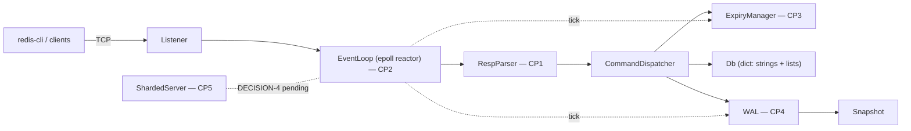

# hermitdb

A RESP2-compatible in-memory key-value store in C++17. Speaks to the official
`redis-cli` and `redis-benchmark`. epoll reactor, TTL expiry, write-ahead-log
persistence with crash recovery, configurable threading — no Boost, no
libevent, no third-party protocol or hash-table libraries.

> **Status: bootstrap complete — hand-built core in progress.** The project
> plumbing (build system, keyspace, command dispatch, tests, bench harness)
> was AI-scaffolded in two sessions, by design. Every load-bearing component
> is a **learning checkpoint I implement by hand**, tracked below — the
> server refuses to serve traffic until CP2 exists, on purpose. See
> [How this was built](#how-this-was-built).

| Checkpoint | Component | Status |
|---|---|---|
| CP1 | Incremental RESP2 parser | 🎯 next up |
| CP2 | epoll event loop | ⏳ queued |
| CP3 | TTL expiry (lazy + sampled active) | ⏳ queued |
| CP4 | Write-ahead log + crash recovery | ⏳ queued |
| CP5 | Threading model | ⏳ queued |
| CP6 | LRU eviction (stretch) | ⏳ optional |

<!-- TODO(M7): 30-second asciinema/GIF of redis-cli + kill -9 recovery -->

## Quickstart

```bash
docker build -t hermitdb .
docker run --rm -p 6380:6380 hermitdb
redis-cli -p 6380 SET greeting hello EX 60
redis-cli -p 6380 GET greeting
```

Development happens inside the Linux dev container (epoll doesn't exist on
macOS):

```bash
make image      # once
make configure  # once
make build
make test       # scaffold + m3 tests — always green
make test-all   # + checkpoint tests — red/skipped until each CP is implemented
make run        # server on localhost:6380
make cli        # redis-cli against it (separate terminal)
```

## Command set

| Family | Commands |
|---|---|
| Connection | `PING` `ECHO` `COMMAND` `SHUTDOWN` |
| Strings | `SET` (`EX` `PX` `NX` `XX`) `GET` `INCR` `DECR` `INCRBY` |
| Keyspace | `DEL` `EXISTS` `TYPE` `KEYS <glob>` `DBSIZE` `FLUSHALL` |
| TTL | `EXPIRE` `PEXPIRE` `TTL` `PTTL` `PERSIST` |
| Lists | `LPUSH` `RPUSH` `LPOP` `RPOP` `LRANGE` `LLEN` |
| Server | `CONFIG GET` (stub) |

Error semantics mirror Redis byte-for-byte (`-ERR wrong number of arguments
for 'get' command`, `-WRONGTYPE ...`, `:N` / `$-1` / `*0` replies) — the m3
unit suite pins the exact wire strings.

## Architecture



One thread, one reactor: `epoll_wait` → drain socket → incremental RESP parse
→ dispatch table → reply bytes queued back on the connection. TTL expiry is
two-pronged like real Redis (lazy check on every key access + a budgeted
random-sampling pass on the loop tick). Persistence is snapshot + WAL tail:
every mutating command is appended in RESP encoding (the WAL format *is* the
wire format), and recovery loads the snapshot then replays the tail.

## Benchmarks

Generated by `./bench/run_bench.sh` (matrix: threads × op × fsync policy ×
pipelining, vs. real Redis on the same hardware — raw CSVs and the emitted
table land in `bench/results/`, format documented in
[bench/results/FORMAT.md](bench/results/FORMAT.md)). Numbers in this table
must be reproducible with that script — no cherry-picking; where real Redis
wins, the table says so.

| config | op | ops/sec | p50 ms | p99 ms |
|---|---|---|---|---|
| _pending — filled at M6 on stated hardware_ | | | | |

fsync microbenchmark (anchors the WAL durability story): _pending_.

## Design decisions

Every load-bearing choice is argued in [DECISIONS.md](DECISIONS.md) —
LT vs ET epoll, fsync default, TTL clock source, threading architecture,
dict implementation, DoS-surface caps. Resolutions are written only after
measurement; until then the code refuses to default (try `--wal` without
`--fsync`). Interface-change requests from scaffolding work are argued in
[INTERFACE_PROPOSALS.md](INTERFACE_PROPOSALS.md), not applied silently.

## What I'd build next

Replication (a WAL is already a replication log looking for a follower),
RESP3 push protocol, and io_uring — the reactor's `epoll_wait`/`recv`/`send`
syscall triple per request is exactly the overhead io_uring's submission
rings exist to amortize. Each is scoped out deliberately: scope discipline is
a feature.

## How this was built

This project uses a learning-checkpoint split, and the git history shows it
honestly: `scaffold:` commits are project plumbing generated by Claude Code
(build system, keyspace, command dispatch, snapshot serialization, tests,
docs); `cp<N>:` commits are the checkpoint implementations — the incremental
RESP parser, the epoll event loop, TTL expiry, the write-ahead log, and the
threading model — written by hand. Study sheets for each checkpoint are in
[checkpoints/](checkpoints/); the final adversarial review is logged in
`checkpoints/VIVA.md`. Acceptance tests for every checkpoint were written
against the stubs and fail (or skip, loudly) until the real implementation
lands — a stub passing silently is treated as a bug in the tests.
