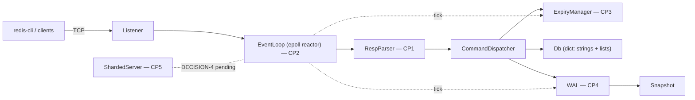

# hermitdb

A RESP2-compatible in-memory key-value store in C++17. Speaks to the official
`redis-cli` and `redis-benchmark`. epoll reactor, TTL expiry, write-ahead-log
persistence with crash recovery, configurable threading — no Boost, no
libevent, no third-party protocol or hash-table libraries.

> **Status: M0 (scaffolding).** The load-bearing components are learning
> checkpoints, deliberately unimplemented — see *How this was built* below.

<!-- TODO(M7): 30-second asciinema/GIF of redis-cli + kill -9 recovery -->

## Quickstart

```bash
docker build -t hermitdb .
docker run --rm -p 6380:6380 hermitdb
redis-cli -p 6380 SET greeting hello EX 60
redis-cli -p 6380 GET greeting
```

Development happens inside the Linux dev container (epoll doesn't exist on
macOS):

```bash
make image      # once
make configure  # once
make build
make test       # scaffold tests — always green
make test-all   # + checkpoint tests — red until each CP is implemented
make run        # server on localhost:6380
make cli        # redis-cli against it (separate terminal)
```

## Architecture



## Benchmarks

Generated by `./bench/run_bench.sh` (matrix: threads × op × fsync policy ×
pipelining, vs. real Redis on the same hardware). Numbers in this table are
reproducible with that script — no cherry-picking; where real Redis wins, the
table says so.

| config | op | ops/sec | p50 ms | p99 ms |
|---|---|---|---|---|
| _pending — filled at M6 on stated hardware_ | | | | |

fsync microbenchmark (anchors the WAL durability story): _pending_.

## Design decisions

Every load-bearing choice is argued in [DECISIONS.md](DECISIONS.md) —
LT vs ET epoll, fsync default, TTL clock source, threading architecture,
dict implementation, DoS-surface caps. Resolutions are written only after
measurement.

## What I'd build next

Replication (a WAL is already a replication log looking for a follower),
RESP3 push protocol, and io_uring — the reactor's `epoll_wait`/`recv`/`send`
syscall triple per request is exactly the overhead io_uring's submission
rings exist to amortize. Each is scoped out deliberately: scope discipline is
a feature.

## How this was built

This project uses a learning-checkpoint split, and the git history shows it
honestly: `scaffold:` commits are project plumbing generated by Claude Code
(build system, tests, stubs, docs); `cp<N>:` commits are the checkpoint
implementations — the RESP parser, the epoll event loop, TTL expiry, the WAL,
and the threading model — written by hand. The checkpoint study sheets are in
[checkpoints/](checkpoints/), and the final adversarial review is logged in
`checkpoints/VIVA.md`.
