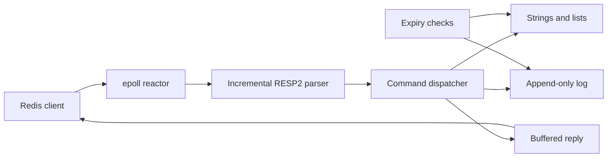

# HermitDB

**An in-memory key-value server in C++17, built on Linux sockets and epoll.**

HermitDB speaks a subset of Redis's RESP2 protocol: connect with `redis-cli`,
store strings and lists, set expiration times, and recover persisted writes
from an append-only log. The networking and storage code uses the C++ standard
library and Linux APIs, without Boost or an external event-loop framework.

[Design notes](DECISIONS.md) · [Test results](docs/verification.md) · [Source](src/)

## Try it

Build and start the server:

```sh
docker build -t hermitdb .
docker run --rm -p 6380:6380 hermitdb
```

In another terminal, with Redis CLI installed:

```sh
redis-cli -p 6380 SET greeting hello EX 60  # OK
redis-cli -p 6380 GET greeting            # "hello"
redis-cli -p 6380 RPUSH tasks parse log   # 2
redis-cli -p 6380 LRANGE tasks 0 -1       # "parse", "log"
```

For persistence, start the server with a named data volume and an explicit
sync policy:

```sh
docker run --rm -p 6380:6380 -v hermitdata:/data hermitdb \
  --port=6380 --data-dir=/data --wal --fsync=always
```

| Policy | Behavior |
|---|---|
| `always` | Synchronize appended records before a successful write reply. |
| `everysec` | Synchronize on periodic event-loop ticks; delays can extend the interval. |
| `no` | Append to the OS page cache and leave flushing to the OS. |

## How it works


```mermaid
flowchart LR
    Client[Redis client] --> Reactor[epoll reactor]
    Reactor --> Parser[Incremental RESP2 parser]
    Parser --> Dispatcher[Command dispatcher]
    Dispatcher --> Store[Strings and lists]
    Dispatcher --> WAL[Append-only log]
    Expiry[Expiry checks] --> Store
    Expiry --> WAL
    Dispatcher --> Reply[Buffered reply]
    Reply --> Client
```

- **Networking:** nonblocking sockets, parsing across partial reads, buffered
  writes, and a read budget to keep one connection from monopolizing a reactor.
- **Expiry:** lazy checks on key access plus sampled background expiration.
  Persisted deadlines are absolute, so restarting does not reset a relative TTL.
- **Persistence:** RESP-encoded mutations, replay on startup, and truncated-tail
  recovery. Detected log write or sync failures stop the server from continuing
  to acknowledge writes. Failed operations are not rolled back in memory.
- **Threading:** `--threads=N` starts N reactors over one shared keyspace.
  Parsing and socket I/O run outside the mutex; command execution, reply
  construction, and WAL work are serialized inside it.

## Supported commands

| Area | Commands |
|---|---|
| Connection | `PING`, `ECHO`, `COMMAND`, `SHUTDOWN` |
| Strings | `SET` (`EX`, `PX`, `NX`, `XX`), `GET`, `INCR`, `DECR`, `INCRBY` |
| Keys | `DEL`, `EXISTS`, `TYPE`, `KEYS`, `DBSIZE`, `FLUSHALL` |
| Expiry | `EXPIRE`, `PEXPIRE`, `PEXPIREAT`, `TTL`, `PTTL`, `PERSIST` |
| Lists | `LPUSH`, `RPUSH`, `LPOP`, `RPOP`, `LRANGE`, `LLEN` |

`CONFIG GET` is a stub. Protocol support is a subset of Redis compatibility.

## Build and test

The development container supplies Linux, GCC, CMake, and Redis tools:

```sh
make image
make configure
make test
```

The latest local verification used GCC 13.3.0 in a Linux ARM64 container:

| Check | Result |
|---|---|
| Full unit and integration suite | 16/16 test groups passed |
| Integration with 2, 4, and 8 reactors | 7/7 groups passed at each setting |
| ThreadSanitizer: concurrent clients and INCR, 4 reactors | 2/2 groups passed |

Tests cover fragmented commands, pipelining, slow readers, expiry, WAL failures,
and process-crash recovery against a shadow model. CI requires the full suite
at 1, 2, 4, and 8 threads. See the [verification record](docs/verification.md)
for exact scope; SIGKILL recovery tests do not simulate hardware power loss.

## Benchmarking

Run the comparison harness inside the development container:

```sh
make shell
./bench/run_bench.sh ./build/hermitdb
```

It compares SET, GET, and INCR against Redis, varies reactor count and WAL
policy, and tests pipelining at 1 and 16. Each run writes CSV output and a
Markdown table under `bench/results/`. The default is one million **requests**
per operation with 50 clients.

Performance has not been remeasured for this revision. Earlier tables are
[archived](docs/history/README.md#benchmarks); their raw outputs were not committed.

## Current scope

HermitDB is a systems learning project for controlled environments. It has no
authentication, TLS, replication, memory limit, or eviction policy.

Snapshot loading is supported, but compaction is disabled pending a safe
snapshot/WAL recovery boundary. WAL records have no checksums.
[Design notes](DECISIONS.md) cover these trade-offs and remaining work.

## Development

The initial scaffolding and core implementations were generated with Claude
Code; subsequent review and repairs also used AI assistance. Component-level
history is preserved in the commits. The [original specification](SPEC_kvstore.md)
and [checkpoint exercises](checkpoints/) document the learning workflow.
